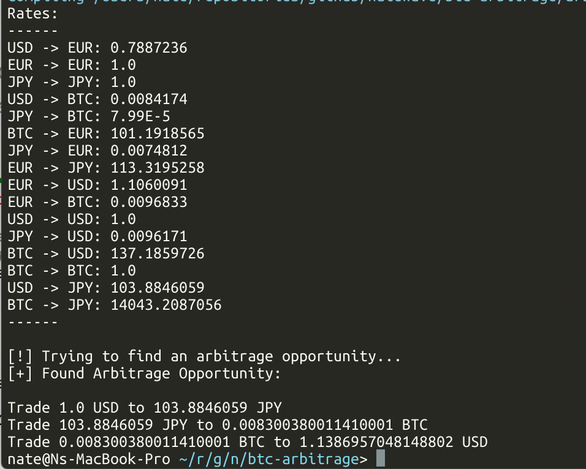

## BTC Arbitrage

A solution to priceonomics Bitcoin Arbitrage puzzle.

> Puzzle link: https://priceonomics.com/jobs/puzzle/

Written in Scala as an Ammonite Script. To run, simply call Ammonite
with the filename as parameter: 

`$ amm arbitrage.sc`

---
Explanation:

If we take the example given by priceonomics, there is an arbitrage loop if we follow
the sequence $ -> € -> BTC -> $

Using the rates provided, it means: 1 * 0.7779 * 0.01125 * 115.65 = 1.01209651875
We start with 1 dollar and end up with 1.01209651875

We can generalize this pattern and look for a sequence where the product of rates is > 1

`currency1_currency2_rate * currency2_currency3_rate * ... * Cn_C1 > 1`

If we model our solution as a graph with each node representing a currency, and the edge
between two nodes as the exchange rate, we are looking for is a route with the following property:

`rate(currency1, currency2) * rate(currency2, currency3) * ... * rate(currencyn, currency1) > 1`

We can easily use brute-force to find such a route if one exists, it's an easy cumulative
product that's greater than 1, however, a simple Google search shows that if we take the negative
log of each edge, we can turn the problem of finding a cumulative product that’s greater than 1
into finding a negative sum cycle in our graph, and that there is an algorithm called Bellman Ford
that allows for working on negative cycles within a directed graph.
.

`log(rate(currency1, currency2) * rate(currency2, currency3) * ... * rate(currencyn, currency1)) > log(1)`

`log(rate(c1, c2)) + log(rate(c2, c3)) + ... + log(rate(cn, c1)) > 0`

`-log(rate(c1, c2)) -log(rate(c2, c3)) - ... - log(rate(cn, c1)) < 0`

Bellow is an implementation of such an algorithm in Scala.

sttp from softwaremill is used as an http-client and circe for decoding the JSON.

Bellman Ford for a graph with |V| vertices and |E| edges has an average time complexity of O(|V||E|)
and space complexity of O(|V|)